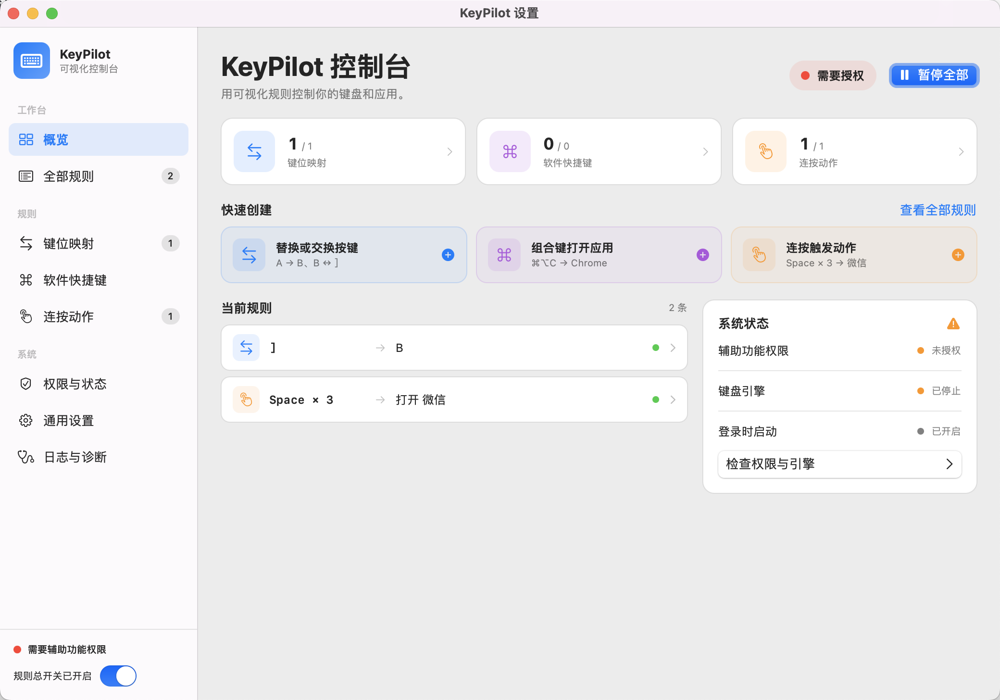
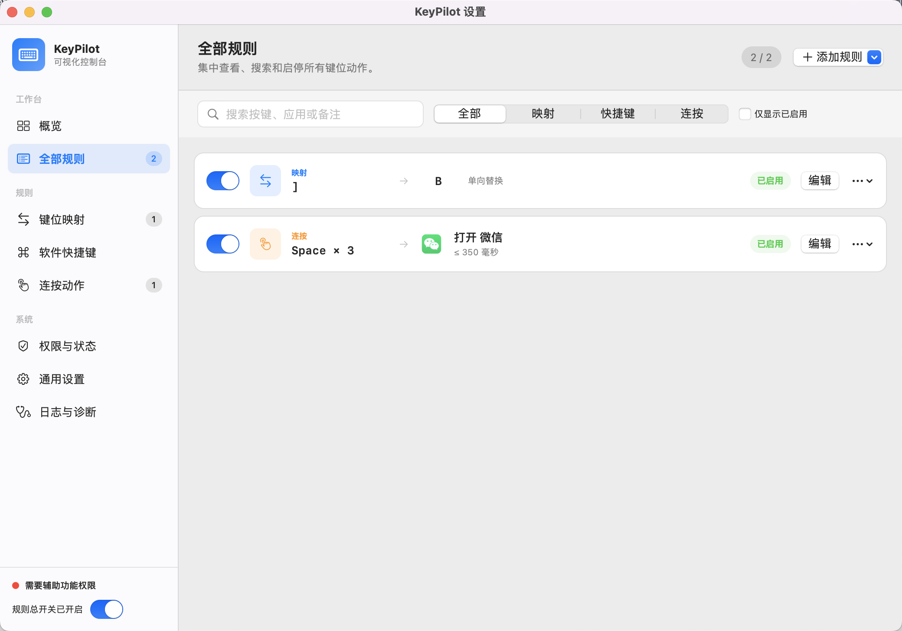
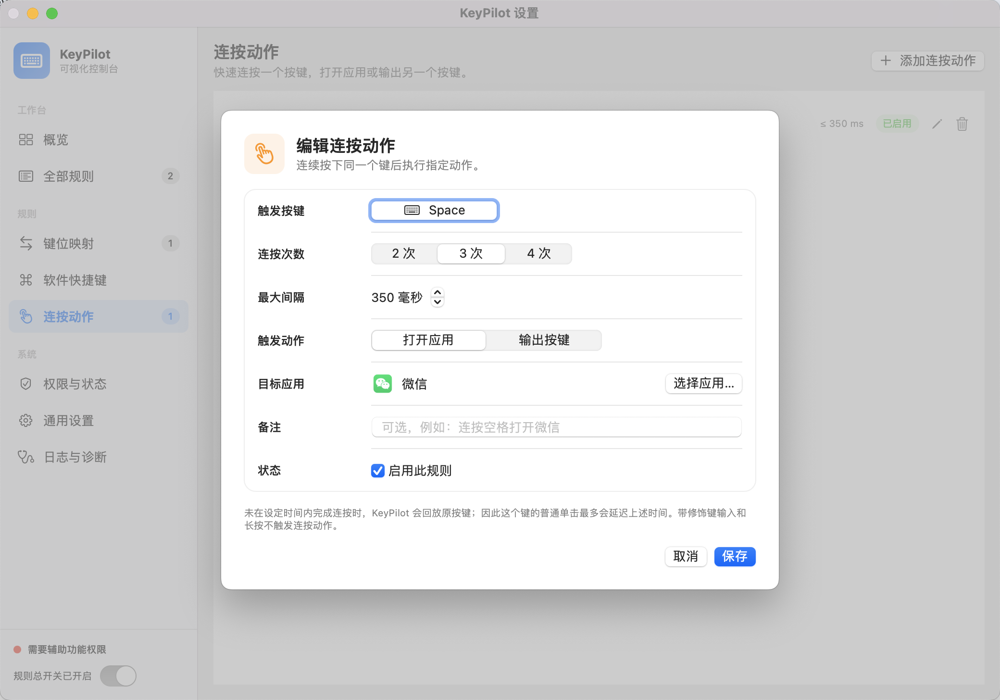

# KeyPilot for macOS

KeyPilot 是一个原生 macOS 菜单栏工具，用虚拟键码实现全局键位重映射、双向按键交换，并通过自定义全局组合键启动或激活应用。它以低延迟、可恢复和隐私安全为首要目标，不记录用户输入。

> 当前版本：1.2.1

## 功能

- 全新可视化控制台：概览、规则统计、运行状态和常用操作集中展示
- 左侧分类导航与统一规则中心，可跨类型搜索、筛选、行内启停、复制和删除
- 三种规则均可从控制台一键创建；统一规则中心可单击直达对应编辑器
- 单向键位映射，例如 `A → B`
- 双向按键交换，例如 `B ↔ ,`
- 真实按键录入，不依赖当前输入法输出字符
- 带 Command、Option、Control、Shift 的全局软件快捷键
- 启动未运行应用，或激活已运行实例
- 连按同一按键 2～4 次，打开应用或输出另一个按键
- 连按未完成时自动回放原按键，不丢失普通单击
- 可选吞掉快捷键原始事件，长按不会重复启动
- 菜单栏全局暂停、恢复和运行状态显示
- JSON 配置持久化、备份恢复、严格导入和导出
- 辅助功能权限检查、Event Tap 自动恢复和安全诊断日志
- 使用 `SMAppService.mainApp` 的真实登录项管理

## 功能截图

### 可视化控制台



### 全部规则



### 规则编辑器



## 系统要求

- macOS 12.0 或更高版本
- Intel `x86_64` 与 Apple Silicon `arm64`（同一个 Universal 2 应用）
- Xcode 14.2 或更高版本（完整开发与 XCTest；一键启动也可使用 Command Line Tools）
- XcodeGen 2.38 或兼容版本（从 `project.yml` 重新生成工程时）

KeyPilot 是菜单栏应用，不显示 Dock 图标。第一版面向 Developer ID 签名后的站外分发，不使用 App Sandbox，因为可修改的全局 `CGEventTap` 需要系统辅助功能授权。

## 构建方法

### 一键启动

在 Finder 中双击项目根目录的：

```text
启动KeyPilot.command
```

启动器会自动检查 macOS 版本并打开 KeyPilot。存在完整 Xcode 时使用 Xcode 增量构建；只有 Command Line Tools 时自动构建并签名一个同时支持 Intel 与 Apple Silicon 的 Universal 2 应用。构建结果会安装到固定路径 `~/Applications/KeyPilot.app`，避免系统权限绑定到临时构建目录。首次启动后仍需手动授予辅助功能权限。KeyPilot 最低要求 macOS 12。

### 命令行构建

安装 Xcode 并在 Xcode 设置中选中完整开发工具链，然后执行：

```bash
brew install xcodegen
cd /path/to/KeyPilot
xcodegen generate
xcodebuild -project KeyPilot.xcodeproj \
  -scheme KeyPilot \
  -configuration Debug \
  -destination 'platform=macOS' \
  CODE_SIGNING_ALLOWED=NO build
```

也可以运行：

```bash
./scripts/build.sh
```

只有 Command Line Tools 时可构建 Universal 2 App Bundle：

```bash
./scripts/build-local.sh
open .build/LocalBuild/KeyPilot.app
```

`KeyPilot.xcodeproj` 已包含在仓库中；修改 `project.yml` 或新增源码文件后应重新运行 XcodeGen。

## 首次运行与辅助功能权限

KeyPilot 需要辅助功能权限，才能在其他应用中识别和修改键盘事件。KeyPilot 不保存您输入的文字，不上传键盘数据。

首次运行时：

1. 打开 KeyPilot 设置的“权限与状态”页。
2. 点击“打开系统设置”。
3. 在“隐私与安全性 → 辅助功能”中启用 KeyPilot。
4. 返回 KeyPilot，点击“请求并重新检查”。
5. 确认 Event Tap 显示“运行中”。

如果权限被撤销，KeyPilot 会停止事件引擎并显示不可用状态，不会假装规则仍在生效。

### 已授权但仍显示“未授权”

本地构建使用临时签名；重新编译后 macOS 可能把新签名识别为另一个应用。请确保授权对象是固定路径：

```text
~/Applications/KeyPilot.app
```

如果列表中保留的是旧版本，可执行：

```bash
tccutil reset Accessibility com.keypilot.mac
```

然后双击 `启动KeyPilot.command`，在 KeyPilot 中点击“请求并重新检查”，回到“安全性与隐私 → 隐私 → 辅助功能”，使用加号选择 `~/Applications/KeyPilot.app` 并勾选。必要时退出 KeyPilot 后重新启动。正式 Developer ID 签名可避免版本更新后重新授权；临时本地签名在应用重新编译后可能需要再次授权。

1.1.1 起，“权限与状态”页面提供“授权后重启 KeyPilot”。系统列表勾选后仍显示未授权时，请先确认授权路径为 `~/Applications/KeyPilot.app`，再点击该按钮。构建脚本会优先使用钥匙串中已有的 Developer ID、Apple Development 或 Mac Developer 身份；没有可用身份时才回退到临时签名。

## 使用方法

### 可视化控制台

从菜单栏选择“打开 KeyPilot 设置”后，默认进入可视化控制台：

1. 顶部状态胶囊显示辅助功能权限、键盘引擎和总开关的综合状态。
2. 三张统计卡片分别显示“已启用 / 总数”，点击即可进入对应规则页。
3. “快速创建”可直接打开键位映射、软件快捷键或连按动作编辑器。
4. “全部规则”可跨类型搜索按键、应用和备注，并支持筛选、行内启停、创建停用副本及确认删除。
5. 左侧栏始终显示各类规则总数和键盘引擎状态，方便随时切换与检查。

### 添加键位映射

1. 从菜单栏打开设置，进入“键位映射”。
2. 点击“添加规则”。
3. 分别点击录入控件并按下原按键和目标按键。
4. 选择“单向替换”或“双向交换”。
5. 保存。冲突、自映射和第一版不支持的链式映射会被拒绝。

按键录入时 Escape 默认取消；需要把其他按键映射为 Escape 时，使用录入状态旁的“设为 Escape”。普通映射同时转换 `keyDown` 和 `keyUp`。

### 添加软件快捷键

1. 进入“软件快捷键”，点击“添加快捷键”。
2. 录入至少包含一个修饰键的组合键，例如 `⌘⌥C`。
3. 选择一个 `.app`。
4. 决定是否吞掉原始事件并保存。

KeyPilot 先按原始物理键码匹配快捷键，再执行普通映射。按住快捷键只触发一次；主按键松开后才允许再次触发。应用身份优先使用 Bundle Identifier，保存路径仅作备用。

请避免把 `Command + Q` 用作软件快捷键：它是 macOS 的“退出当前应用”。如果 KeyPilot 尚未取得辅助功能权限或 Event Tap 没有运行，该组合键会被当前应用直接处理。建议改用 `Command + Option + Q` 等不与系统菜单冲突的组合键。

### 添加连按动作

1. 进入“连按动作”，点击“添加连按动作”。
2. 录入触发按键，选择连按 2、3 或 4 次。
3. 设置最大间隔；默认 350 毫秒，范围为 150～1000 毫秒。
4. 选择“打开应用”或“输出按键”，设置目标后保存。

例如设置 `Q × 2 → 打开微信`，快速按两次 Q 会启动或切换到微信；设置 `A × 2 → 输出 B`，快速按两次 A 只输出一个 B。如果没有在时间窗口内完成连按，KeyPilot 会自动回放原按键。被设为触发键的普通单击因此会有最多一个判定窗口的延迟；带 Command、Option、Control、Shift 的输入和长按不会触发连按动作。

KeyPilot 1.1.2 起会在键盘引擎运行期间保持后台低延迟活动。目标应用已在后台、隐藏或关闭主窗口时，连按动作会先取消隐藏并激活，再发送正常的应用“重新打开”请求，确保窗口回到前台且不会创建第二个应用实例。

### 暂停、恢复和退出

- 在菜单栏选择“暂停所有规则”可立即恢复系统原始按键行为。
- 选择“恢复所有规则”重新启用有效规则。
- 退出 KeyPilot 会销毁 Event Tap，键盘立即恢复原始行为。

## 配置文件

正式配置：

```text
~/Library/Application Support/KeyPilot/config.json
```

恢复备份：

```text
~/Library/Application Support/KeyPilot/config.backup.json
```

配置使用带 `schemaVersion` 的可读 JSON。保存过程执行规则校验、原子写入、回读解码校验和备份更新。正式配置损坏时尝试从备份恢复；两者都不可用时才加载安全默认配置，并写入诊断事件。

## 导入和导出

在“通用”页选择“导入配置”或“导出配置”。导入文件先在内存中严格解码，并校验 schema 版本、映射冲突、快捷键冲突和连按规则冲突；只有用户确认后才替换当前配置。非法 JSON 不会覆盖当前配置。导出内容不包含诊断日志或按键历史。旧版配置没有 `multiPressRules` 字段时会按空列表兼容加载。

## 隐私与安全

KeyPilot：

- 不保存原始键盘事件流、完整按键序列或实际输入文字
- 不记录密码、聊天内容、输入法候选或浏览器地址
- 不发送网络请求，不包含账户、遥测、分析 SDK 或云同步
- 不申请 root，不安装内核扩展，不使用私有 API
- 不执行脚本、Shell 命令或用户未配置的动作
- 诊断日志只包含时间、模块、状态、错误、规则 ID 和快照版本，且仅保留本次运行最近 100 条

Event Tap 回调仅执行不可变快照读取、字典查询、少量按下状态更新和键码替换。磁盘、JSON、应用启动和界面操作均不在回调内同步执行。

## 已知限制

- 辅助功能权限必须由用户手动授予；代码无法代替用户完成授权。
- 登录、锁屏、FileVault 密码界面和系统安全输入区域不在支持范围内。
- 当前版本不支持任意宏、应用专属配置、Fn/媒体键完整映射或单独映射纯修饰键。
- 系统快捷键或其他软件可能先行占用组合键；KeyPilot 只检测自身配置内的重复。
- JIS、ANSI、ISO 键盘键帽文字可能不同，运行时始终以录入的真实虚拟键码为准。
- 第三方键盘修改工具同时运行时可能与 KeyPilot 冲突。

## 测试

完整 XCTest：

```bash
./scripts/test.sh
```

完整 Xcode 工具链也可以通过 Swift Package 运行同一套核心 XCTest：

```bash
swift test
```

如果精简版 Command Line Tools 没有提供 XCTest 模块，可运行不依赖 XCTest 的 20 项核心烟雾检查：

```bash
./scripts/core-smoke.sh
```

测试覆盖规则编译、双向交换、冲突、快捷键规范化、防长按、keyDown/keyUp、配置原子保存与备份恢复，以及可注入 Mock 的应用解析器。

## 人工验收

### 1. B 与逗号互换

1. 添加并启用 `B ↔ ,`。
2. 打开 TextEdit；按 B 应输入逗号，按逗号应输入 B。
3. 长按并快速交替输入，确认没有粘键。
4. 暂停全部规则，确认恢复原行为；退出 KeyPilot 后再次确认。

### 2. 单向映射

1. 添加一组安全普通按键的单向映射。
2. 验证目标行为，然后停用该规则。
3. 确认系统恢复原行为。

### 3. 启动软件

1. 添加 `Command + Option + C` 并选择 Chrome。
2. Chrome 未运行时触发，确认启动。
3. Chrome 已运行但不在前台时触发，确认切到前台。
4. 长按组合键，确认不重复启动实例。
5. 打开“吞掉原始事件”，确认当前应用不再收到组合键。

### 4. 权限

1. 在系统设置中撤销 KeyPilot 的辅助功能权限。
2. 确认 KeyPilot 显示不可用，且不显示规则正常生效。
3. 重新授权并点击“重新检查”，确认引擎恢复运行。

### 5. 配置

1. 创建多条规则，退出并重开应用，确认规则保留。
2. 导出配置、删除规则、再导入配置，确认恢复。
3. 尝试导入非法 JSON，确认当前配置未被覆盖。

建议发布前在 Intel/Apple Silicon、内置/USB/蓝牙键盘、ANSI/JIS 布局及中英文输入法下完成稳定性测试。

## 发布、签名与公证

Release 构建应使用 Apple Developer Program 的 Developer ID Application 证书签名、启用 Hardened Runtime，并通过 `notarytool` 提交公证。公证完成后执行 stapling，再以 ZIP 或 DMG 分发。`scripts/package.sh` 负责生成本地签名归档与 ZIP 的基本流程；正式签名身份、公证凭据和团队 ID 必须由发布者在 Xcode/CI 中配置，不应提交到源码。

## 卸载

1. 从菜单栏退出 KeyPilot。
2. 在“通用”页先关闭“登录时启动”。
3. 从“应用程序”目录删除 KeyPilot。
4. 可选删除用户配置：

```text
~/Library/Application Support/KeyPilot
```

也可在系统设置的辅助功能列表中移除 KeyPilot 条目。
